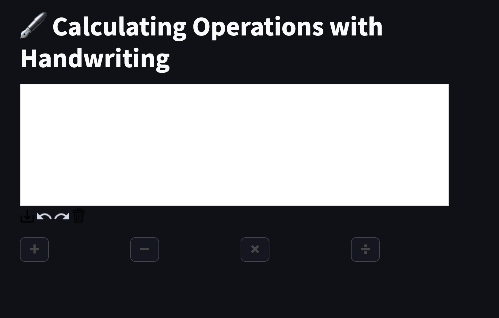
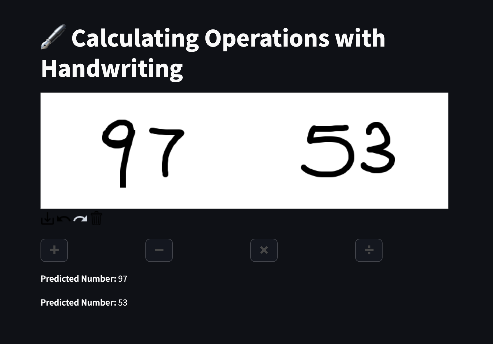
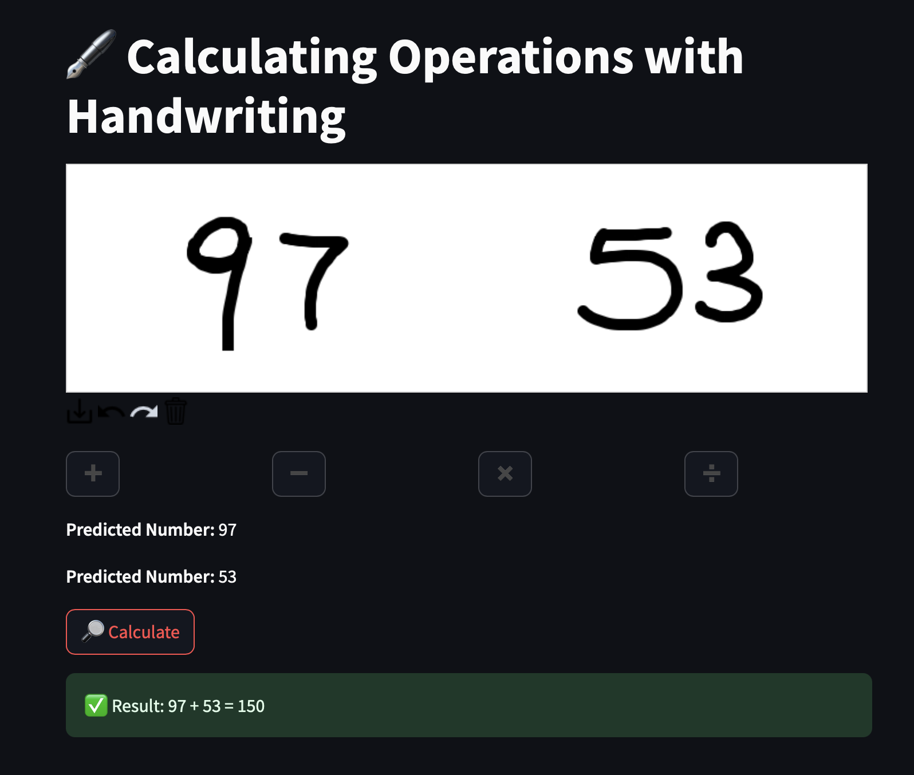
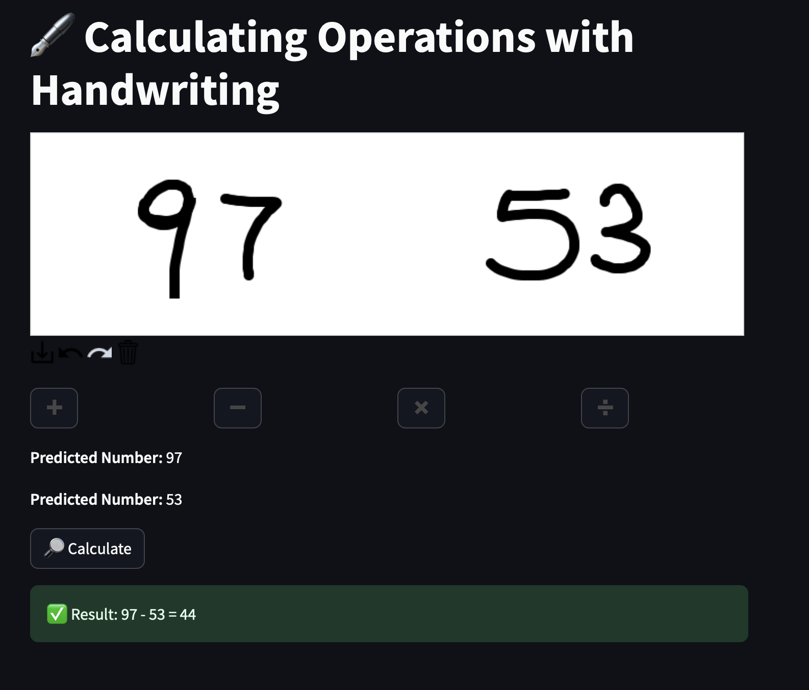
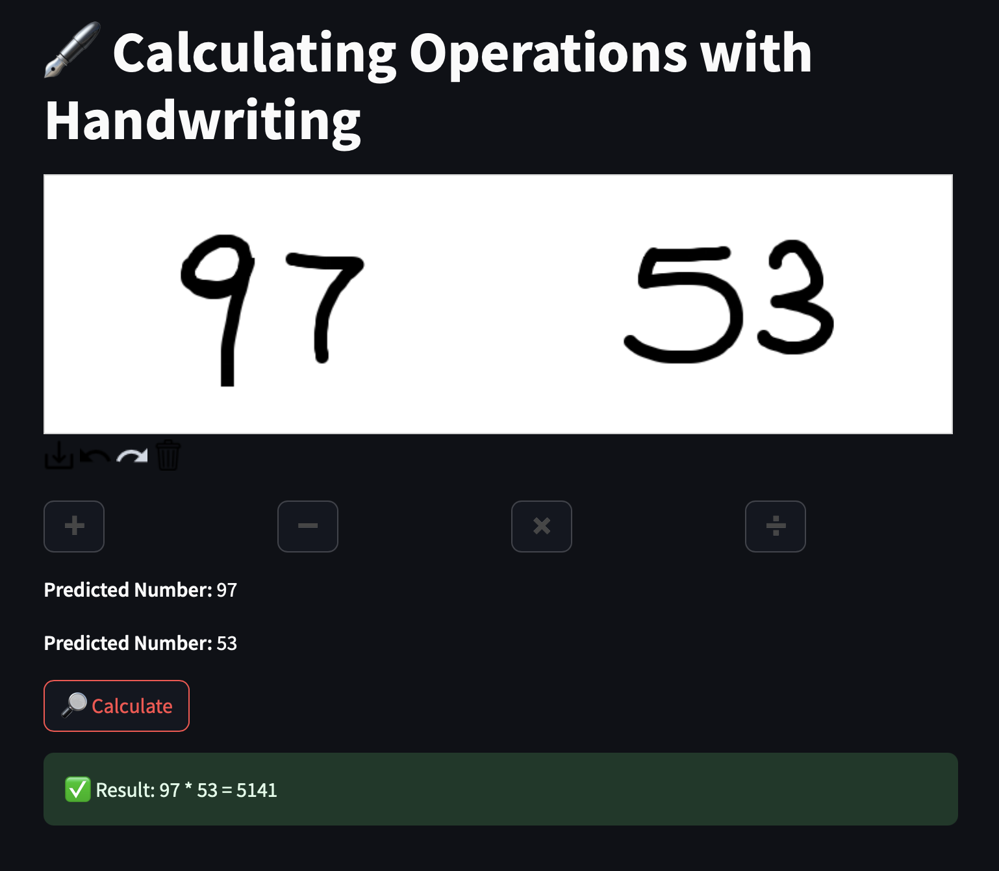
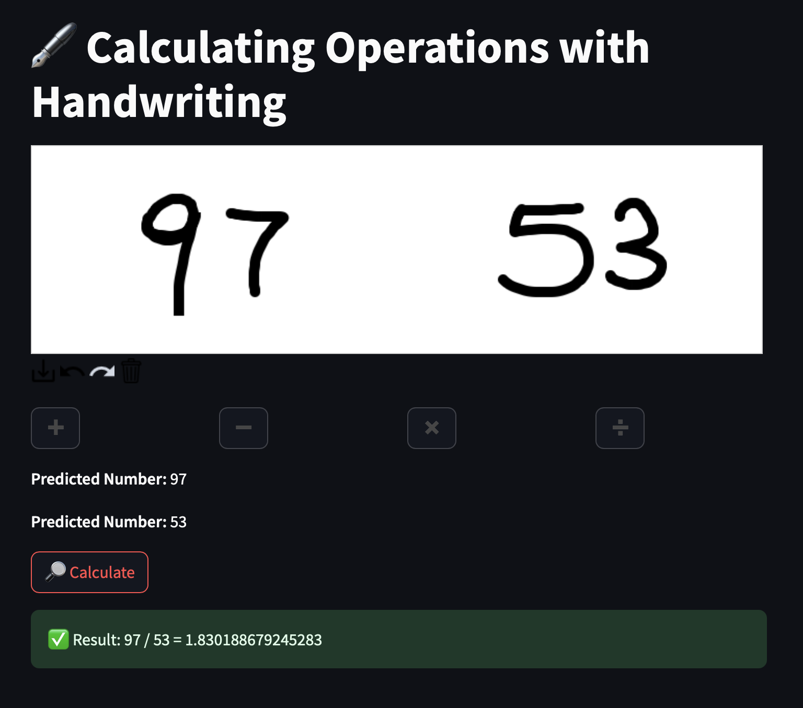
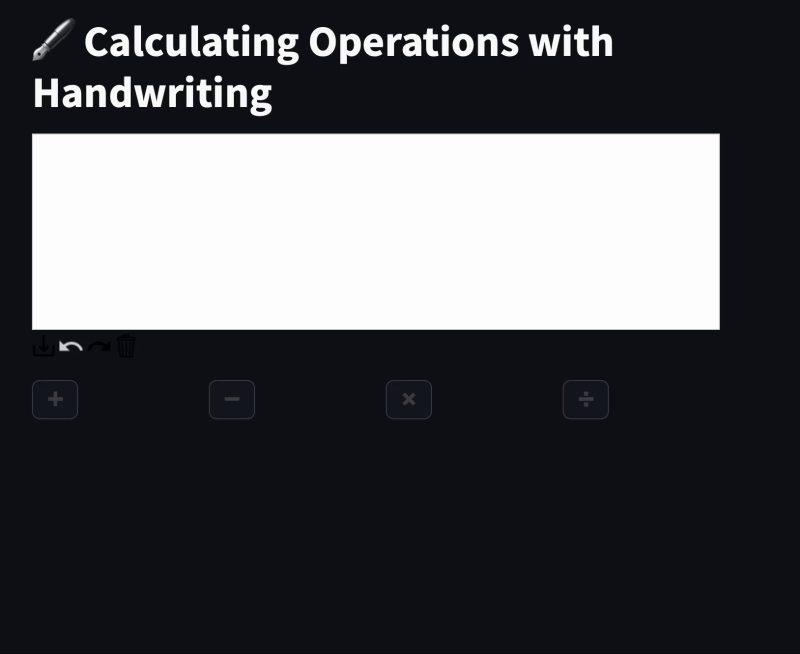

# 🖋️ Handwritten Digit Recognition and Calculator 🧮

This project is an AI-powered calculator that recognizes handwritten digits drawn by the user and performs basic arithmetic operations (**addition, subtraction, multiplication, division**) through a clean and interactive web interface.

The system uses a Convolutional Neural Network (CNN) trained on the **MNIST** dataset for digit recognition. It is fully integrated with a **Streamlit-based GUI** where users can freely draw numbers and select the operation via buttons. The recognized digits are then used to calculate and display the result.

---

## 🚀 Features

- ✍️ **Handwritten Digit Recognition (0-9)** using a CNN model.
- ➕ ➖ ✖️ ➗ Supports **basic arithmetic operations**.
- 🎨 Interactive and intuitive **Streamlit drawing canvas**.
- ⚡ Real-time **digit segmentation and prediction**.
- ✅ Instant feedback: See recognized digits before calculation.
- 🖼️ Debugging option: Saves segmented digit images for inspection.

---
```
## 🏗️ Project Structure
├── main.py # Streamlit web app (GUI and logic) 
├── model.py # CNN architecture for digit recognition 
├── predict.py # Digit segmentation and prediction logic 
├── train.py # Model training script with data augmentation 
├── best_digit_model.pt # Trained CNN model weights 
├── debug_chars/ # Saved segmented digits for debugging 
├── requirements.txt # Project dependencies └── README.md # This file
```


---

## 🧠 Technologies Used

- **Python 3.9+**
- **PyTorch** (for model training and prediction)
- **Torchvision** (for MNIST dataset and transforms)
- **OpenCV** (for contour detection and segmentation)
- **Pillow (PIL)** (image processing)
- **Streamlit** (interactive web application)
- **streamlit-drawable-canvas** (drawing area)

---

## 🏋️ Model Architecture

- 🟢 **3 Convolutional Layers** with Batch Normalization and MaxPooling.
- 🟠 Fully Connected Layers with Dropout (for regularization).
- 🔥 Trained on the **MNIST dataset** with **advanced data augmentation** (rotation, affine transforms, contrast jitter, blur, erasing).
- 🎯 Accuracy achieved: **~95% on test set.**

---

## 📦 Installation

Clone the repository:

```bash
  git clone https://github.com/BurakCANKURT/handwritten-math-recognition.git

  cd handwritten-math-recognition
```

## Install the required packages:
```
  pip install -r requirements.txt
```


## ⚙️ How to Use

1. Train the model (if needed):

> python train.py

(Pretrained best_digit_model.pt is already included.)

2. Start the Streamlit web app:

> streamlit run main.py

3. Draw numbers on the canvas, select the operation via buttons, and get the result instantly.


## 🖼️ Example Screenshots

### 🚩 Initial State (Before Drawing)


---

### ✍️ Digits Drawn and Recognized


---

### ✅ Operation Selected and Result Calculated





---

## 🎞️ Demo GIF




📌 What I Learned

- Designing and training CNN models for computer vision tasks.
- Implementing real-time digit segmentation and prediction.
- Developing interactive user interfaces with Streamlit.
- Combining deep learning models with web applications for end-to-end solutions.


🧑‍💻 Developed by Burak CANKURT

LinkedIn = www.linkedin.com/in/burak-cankurt-545262222
